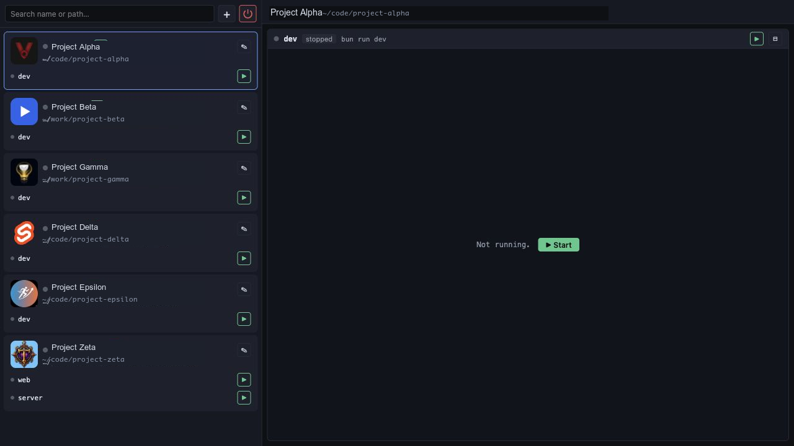

# bunrun

Local dashboard for starting, stopping, and watching a set of development apps.
It is built with Bun, Svelte, and Vite, and is intended for a single-user
localhost workflow.



## Trust model

bunrun binds to localhost and has no authentication. It runs shell commands
from `data/projects.yaml` as your user with no sandboxing, so only point it at
projects and commands you already trust.

## What it does

- Keeps your dev projects in one sidebar with favicons, paths, and status dots.
- Starts, stops, and restarts each configured process.
- Streams stdout and stderr into the main pane with ANSI colors.
- Watches `data/projects.yaml`, so agent-generated config updates show up while
  the app is running.
- Can open detected app URLs after startup when a process exposes one.
- Includes UI for manually adding and editing projects, processes, and `.env`
  files.

## Setup

Install dependencies:

```sh
bun install
```

Create project config with the bundled agent skill:

```text
Use SKILL.md to discover/register my projects for bunrun.
Scan ~/koodi with max depth 1.
```

The skill writes `data/projects.yaml`, preserving user-owned UI state on
rescans. It can scan one project directory or a parent directory containing many
projects.

Then run the dashboard:

```sh
bun run dev
```

By default, the Bun API listens on `127.0.0.1:3939` and the Vite dev UI opens on
`http://localhost:3940`.

## Config

`data/projects.yaml` is the source of truth. A minimal entry looks like this:

```yaml
- id: my-app
  name: My App
  path: /Users/you/koodi/my-app
  category: null
  favicon: public/favicon.ico
  envFile: .env
  processes:
    - name: dev
      command: bun run dev
      cwd: null
      port: 5173
      url: null
      urlPattern: null
      openOnStart: true
  ui:
    pinned: false
    logEnabled: false
```

The process `command` is run as a shell string from the project directory, so
commands such as `bun run dev`, `npm run dev`, environment prefixes, pipes, and
`&&` chains work as written.

## Scripts

- `bun run dev` starts the Bun server and Vite UI for development.
- `bun run build` builds the Svelte frontend.
- `bun run bunrun` starts the Bun server.
- `bun run typecheck` runs TypeScript and Svelte checks.
- `bun run lint` checks formatting with Prettier.

## License

MIT &mdash; see [LICENSE](LICENSE).
